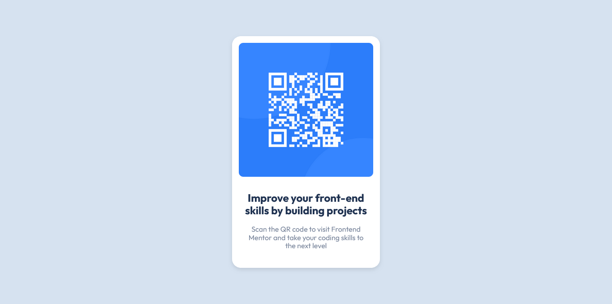

## Table of contents

- [Overview](#overview)
  - [Screenshot](#screenshot)
  - [Links](#links)
- [My process](#my-process)
  - [Built with](#built-with)
  - [What I learned](#what-i-learned)
  - [Continued development](#continued-development)
  - [Useful resources](#useful-resources)
- [Author](#author)
- [Acknowledgments](#acknowledgments)

## Overview

### Screenshot



### Links

The source code for the project is available here:

- Solution URL: (https://github.com/alimassidik210/Qr-code-component.git)

You can see the live version of the project here:

- Live Site URL: (https://qr-code-component-nine-lyart.vercel.app/)

## My process

### Built with

- Semantic HTML5 markup
- CSS custom properties

### What I learned

In this simple project, I practiced how to create a project that aligns with the design provided by UI/UX. Additionally, in this project, I trained myself to write a README.md file to clearly explain a project to the public.

To see how you can add code snippets, see below:

```html
<div class="card">
  
  <div class="card-content">
    <h2>Improve your front-end skills by building projects</h2>
    <p>
      Scan the QR code to visit Frontend Mentor and take your coding skills to
      the next level
    </p>
  </div>
</div>
```

```css
.container .card-content {
  text-align: center;
  font-family: "Outfit", sans-serif;
  font-optical-sizing: auto;
  font-weight: 400;
  padding: 10px;
}
```

If you want more help with writing markdown, we'd recommend checking out [The Markdown Guide](https://www.markdownguide.org/) to learn more.

### Continued development

"In the next project, I want to use SASS to make writing CSS code simpler."

### Useful resources

- [CSS Documentation](https://www.w3scholl.com) - - This resource provided comprehensive information on using CSS.

## Author

- Website - [alim assidik](https://mini-portfolio-yp8m.onrender.com)
- Frontend Mentor - [@alimassidik210](https://www.frontendmentor.io/profile/alimassidik210)
- Instagram - [@yourusername](https://www.instagram.com/alim.assidik210)

## Acknowledgments

I would like to express my gratitude to the following individuals for their invaluable contributions to this project:

- [abdul latif] - Provided guidance and support throughout the development process.
- [sandika galih] - Inspired me with their innovative approach to problem-solving.
- [Frontend mentor web] - Their insights and feedback significantly improved the final outcome.

Thank you all for your dedication and commitment to making this project a success.
